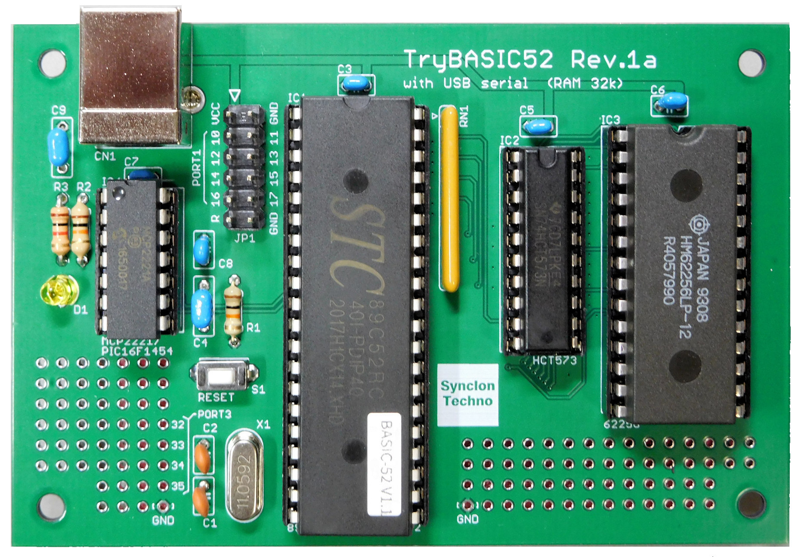
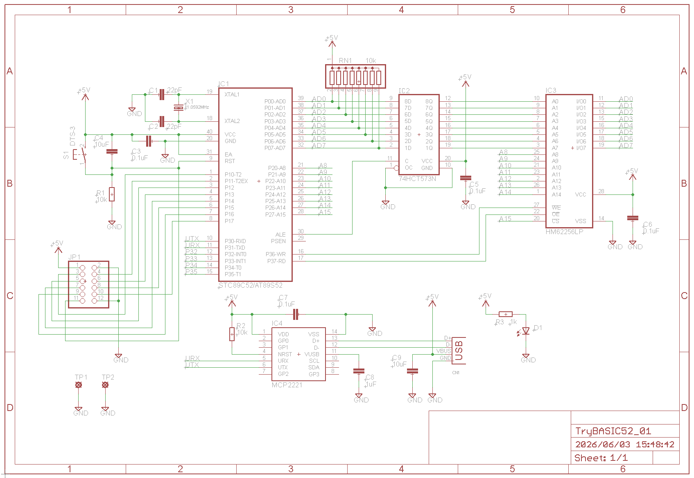
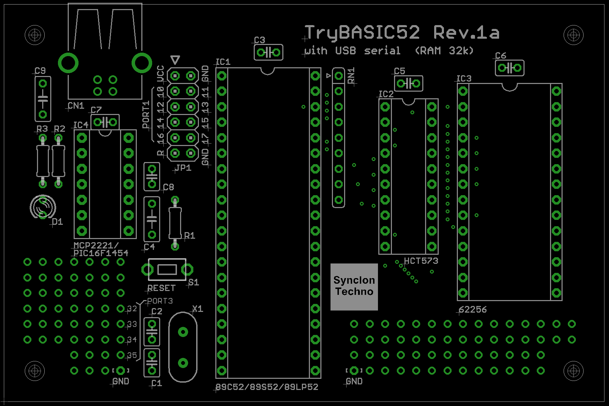
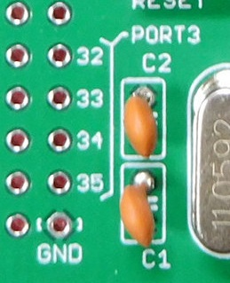

# TryBASIC52
TryBASIC52 はレトロなBASIC言語(インタプリタ) BASIC-52 を動かすためのシンプルなシングルボードコンピュータです。

## はじめに
BASIC-52は1980年代に8052マイコン用としてインテルが開発した言わば純正のBASIC言語(インタプリタ)で今ではフリーウェアとなっています。  
TryBASIC52 はこの伝説的なBASIC-52を手軽に動かすために開発したもので、現在でも比較的入手性の高い中国STC社製のSTC89C52や旧ATMEL(現Microchip)製のAT89S52/AT89LP52を搭載することができるシングルボードマイコンで、マイコン黎明期のテクノロジーをお手元で手軽に体感するのに最適なものです。 

TryBASIC52ボード写真
 

マイコン周辺の回路はオーソドックスな構成をとっているので、BASIC-52だけでなく、PaloAlto TinyBasicの8051シリーズ移植版であるTinyBasic51(TB51)などもマイコンフラッシュの書換えでそのまま実行することが出来ます。  
またボード上にUSBシリアル変換チップ(MCP2221A)を搭載していますのでTryBASIC52ボードとPCとをUSBケーブルで接続するだけでバスパワーで電源供給され、仮想シリアルポート接続でBASIC-52を動作させることができます。

## 仕様
* 対応するMCU  
 STC社製 STC89C52  
 Microchip製 AT89S52,AT89LP52など  
* 256kbit(32kbyte)のSRAM (HM62256など)
* 水晶発振子 11.0592MHz
* USBシリアルインタフェース MCP2221A
* USBバスパワー動作
* 基板サイズ 98mm × 65mm

## ハードウェア説明
回路図

基板上部品配置図(シルク図)

本ボードの構成は上の回路図や部品配置図に示すように非常にオーソドックスなもので組み立ての容易さを勘案して部品はすべてスルーホールタイプを使用しています。  
また本ボードはUSBシリアル変換IC(MCP2221A)を搭載していますのでUSBケーブルでPCと接続するだけでバスパワー動作し、TeraTermなどのターミナルソフトで使用できます。　BASIC-52は自動通信速度判定機能を備えていますので、ターミナルソフト起動後にスペースバーを押下することで通信速度が自動設定されてBASICが起動します。 通信速度は9600bpsや19200bps程度が適切と思われます。
    
BASIC-52のソースコードを見るとわかりますが、BASIC-52は0x2000番地や0x4000番地など、モニタなどのROMがある可能性のある領域をアクセスしてROMの有無を確認するコードがたくさん含まれています。　このため集合抵抗RN1によるバスのプルアップは思わぬ誤動作を防ぐためにも必要とおもわれます。  
また、本ボードではラッチIC(IC2)に入力閾値電圧の低いHCTタイプを使用しています。　通常のHCタイプでも問題なく動作すると思われますが、現時点で入手可能なSTC89C52のデータシートに電気的特性の情報が無いので念のための措置としてHCTタイプを採用しています。
  
本ボードは拡張端子として12ピンのピンヘッダJP1を備えています。　ここにはマイコンのポート１の信号がすべて引き出されています。  信号の配置は下の表のとおりです。
### JP1信号配置表
端子番号|信号名|端子番号|信号名|
--------|--------|--------|--------|
1|+5V|2|GND
3|P10|4|P11
5|P12|6|P13
7|P14|8|P15
9|P16|10|P17
11|RESET|12|GND

### ポート3空き端子
マイコンのポート3の空き端子については基板左下部のユニバーサルエリアにP32～P35を引き出してありますので適宜ご使用ください。  
  
 

## 部品表
部品番号|品名|品番/定数|入手先の例
----------|----------|----------|----------
C1|セラミックコンデンサ|22pF|秋月電子 114483
C2|セラミックコンデンサ|22pF|秋月電子 114483
C3|積層セラミックコンデンサ|0.1uF|秋月電子 104065
C4|積層セラミックコンデンサ|10uF|秋月電子 102216
C5|積層セラミックコンデンサ|0.1uF|秋月電子 104065
C6|積層セラミックコンデンサ|0.1uF|秋月電子 104065
C7|積層セラミックコンデンサ|0.1uF|秋月電子 104065
C8|積層セラミックコンデンサ|1uF|秋月電子 104066
C9|積層セラミックコンデンサ|10uF|秋月電子 102216
R1|固定抵抗|10kΩ|秋月電子 107990
R2|固定抵抗|10kΩ|秋月電子 107990
R3|固定抵抗|1kΩ|秋月電子 125102
RN1|集合抵抗|10kΩ x 8|秋月電子 113917
D1|LED|3mmLED
IC1|マイコンIC|STC89C52|
IC2|ラッチIC|74HCT573N|
IC3|メモリIC|HM62256LP|
IC4|USB IC|MCP2221A|
CN1|USBコネクタ|タイプB|秋月電子 107675
JP1|拡張端子|12ピンヘッダ端子|
S1|押しボタンスイッチ||秋月電子 108074
X1|水晶発振子|11.0592MHz|
-|ICソケット|40ピン|
-|ICソケット|20ピン|
-|ICソケット|28ピン|
-|ICソケット|14ピン|